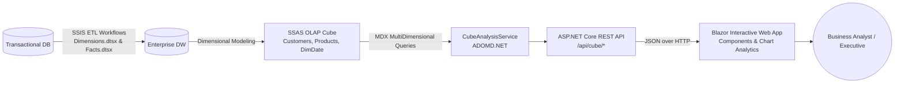

# 📊 Enterprise End-to-End BI Solution & Analytics Hub

A complete, production-grade **End-to-End Business Intelligence & Data Warehousing Architecture** containing the full lifecycle:
1. **ETL Data Pipeline (SSIS):** Extracts, transforms, and populates dimensional & fact tables (`SSIS_ETL/`).
2. **Multidimensional OLAP Cube (SSAS):** Pre-aggregated dimensional modeling with hierarchies and measures (`SSAS_OLAP_Cube/`).
3. **RESTful Query API (ASP.NET Core):** Translates business queries into MDX and interfaces via ADOMD.NET (`EntrepriseDashboard/`).
4. **Interactive Executive Dashboard (Blazor):** Dynamic KPI cards, trend charts, and multidimensional analysis (`EntrepriseDashboardFront/`).

---

## 🏛️ End-to-End Architecture

---

## 🚀 Key Features

### 1. Executive Sales Dashboard (Dashboard.razor)
* **Real-Time KPIs:** Total Revenue, Total Amount Paid, Outstanding Balance, Payment Rate.
* **Temporal Trend Analysis:** Revenue vs. Paid Amount tracked month-over-month.

### 2. Customer Insights & Segmentation (Customers.razor)
* Revenue breakdown and order volumes per customer.
* Credit analysis and payment compliance ratios.

### 3. Product Performance (Products.razor)
* Top revenue-generating products and categories.
* Volume of units sold vs. margin profitability.

### 4. Cross-Dimensional Matrix (CustomersProducts.razor)
* Multidimensional cross-analysis connecting customer profiles directly to purchased product lines.

### 5. Inventory & Supply Chain Analytics (Stock.razor)
* Stock availability, movement tracking, and warehouse distribution metrics.

---

## 🛠️ Tech Stack

* **Frontend:** Blazor Web App (C#, Razor Components, CSS/Bootstrap).
* **Backend:** ASP.NET Core Web API.
* **OLAP / Data Source:** Microsoft SQL Server Analysis Services (SSAS), MDX (MultiDimensional Expressions).
* **Connection Provider:** MSOLAP / ADOMD.NET provider for multidimensional querying.

---

## ⚙️ Configuration & Setup

### Prerequisites
* [.NET 8.0 or .NET 9.0 SDK](https://dotnet.microsoft.com/download)
* Microsoft SQL Server with **SSAS (SQL Server Analysis Services)** running
* Deployed Entreprise_Cube SSAS database

### 1. Configure the SSAS Connection
Edit EntrepriseDashboard/appsettings.json to point to your SSAS instance:
`json
{
  "ConnectionStrings": {
    "SsasConnection": "Provider=MSOLAP;Data Source=localhost;Catalog=Entreprise_Cube;Integrated Security=SSPI;Initial Catalog=Entreprise_Cube;"
  }
}
`

### 2. Run the Backend API
`ash
dotnet run --project EntrepriseDashboard
# API will listen on http://localhost:5050 (or configured port)
`

### 3. Run the Blazor Frontend
`ash
dotnet run --project EntrepriseDashboardFront
`

Navigate to https://localhost:7xxx or http://localhost:5xxx to explore the analytical dashboard.

---

## 👨‍💻 Author
**Mahmoud Hentati**  
*Computer Engineering Student | Full-Stack & BI Developer*  
* [LinkedIn](https://www.linkedin.com/) • [GitHub](https://github.com/)
